# 前端开发知识体系全景指南：从入门到精通的完整学习路线

> 这是一份超详细的前端开发知识体系总结，涵盖 HTML、CSS、JavaScript、TypeScript、布局、交互、动画、后台通信、数据图表等核心领域，适合所有阶段的前端开发者收藏学习！

---

## 前言：为什么需要系统学习前端？

在数字化时代，前端开发已经成为构建互联网产品的核心技能。从简单的静态网页到复杂的单页应用，从移动端 H5 到跨平台小程序，前端技术的边界在不断扩展。

然而，面对浩如烟海的技术栈和框架，很多开发者感到迷茫：**应该从哪里开始？需要掌握哪些核心技能？如何构建完整的知识体系？**

本文基于一个完整的前端知识体系网站，为你梳理出清晰的学习路线和知识图谱。无论你是零基础入门，还是想系统提升，这份指南都能为你提供方向。

---

## 一、HTML：网页的基石

### 1.1 HTML 发展历程

HTML（超文本标记语言）自 1991 年诞生以来，经历了 30 多年的演进：

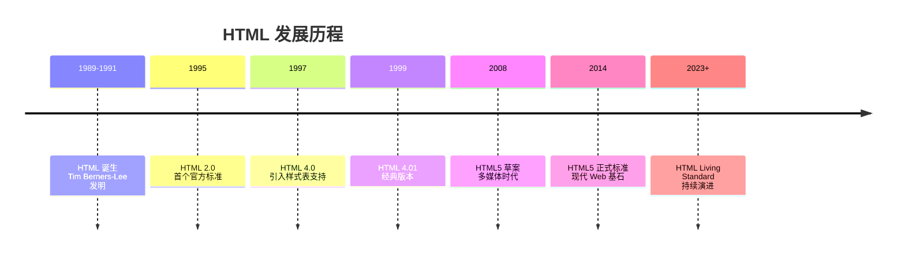

### 1.2 HTML 核心知识模块

**HTML 基础**
- 文档结构与语义化标签
- 文本、链接、图像元素
- 列表、表格、表单

**HTML 表单**
- 输入类型与验证
- 表单控件与布局
- 无障碍表单设计

**HTML5 新特性**
- 语义化标签（`<header>`、`<nav>`、`<main>`、`<footer>`）
- 多媒体（`<video>`、`<audio>`）
- Canvas 与 SVG 图形
- 本地存储（LocalStorage、SessionStorage）
- 地理定位、拖拽 API

**HTML 无障碍（A11Y）**
- ARIA 属性与角色
- 键盘导航支持
- 屏幕阅读器兼容
- 颜色对比度要求

### 1.3 浏览器渲染原理

理解浏览器如何渲染页面对性能优化至关重要：

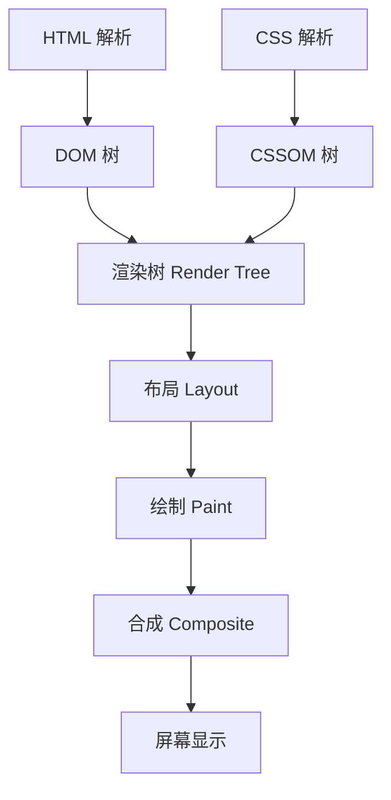

**关键点：**
- **DOM 树**：完整解析所有 HTML 元素，一个都不能少
- **渲染树**：有选择地构建，只包含可见元素
- **布局/绘制/合成**：逐级优化，只处理视口内内容

---

## 二、CSS：样式与布局的艺术

### 2.1 CSS 发展历程

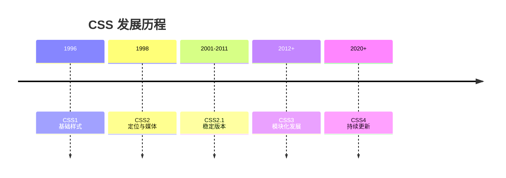

### 2.2 CSS 核心知识体系

**CSS 基础**
- 选择器（类、ID、属性、伪类）
- 盒模型（content、padding、border、margin）
- 层叠与继承
- 颜色与单位

**常用属性**
- 文本样式（font、text、line-height）
- 背景与边框
- 变换与过渡
- 阴影与渐变

**CSS 布局演进**

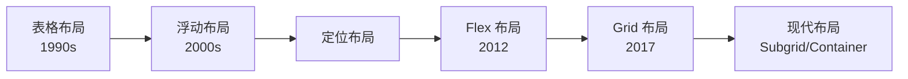

**布局方式对比：**

| 布局方式 | 适用场景 | 优点 | 缺点 |
|---------|---------|------|------|
| 普通流 | 简单文档 | 自然、简单 | 灵活性差 |
| 浮动布局 | 图文混排 | 兼容性好 | 清除浮动麻烦 |
| 定位布局 | 精确控制 | 位置精准 | 脱离文档流 |
| Flex 布局 | 一维布局 | 灵活、简洁 | 复杂网格受限 |
| Grid 布局 | 二维布局 | 强大、完整 | 兼容性稍差 |
| Bootstrap | 快速开发 | 组件丰富 | 代码冗余 |

**CSS 高级特性**
- 自定义属性（CSS Variables）
- 计算函数（calc()）
- 媒体查询与响应式
- 动画与关键帧
- 滤镜与混合模式

**BEM 命名规范**
```css
/* Block Element Modifier */
.block {}
.block__element {}
.block--modifier {}
```

---

## 三、JavaScript：网页的灵魂

### 3.1 JavaScript 发展历程

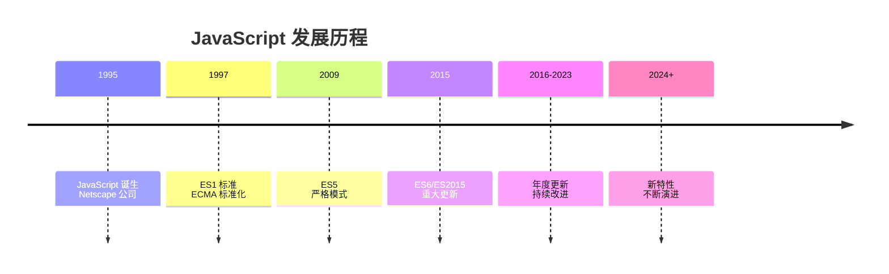

### 3.2 JavaScript 核心知识

**基础语法**
- 变量与数据类型
- 运算符与表达式
- 流程控制
- 函数与作用域

**对象与原型**
- 对象创建与属性
- 原型链与继承
- this 绑定规则
- 类与构造函数

**DOM 操作**
- 元素选择与遍历
- 属性与样式操作
- 节点增删改
- 事件监听与委托

**异步编程**

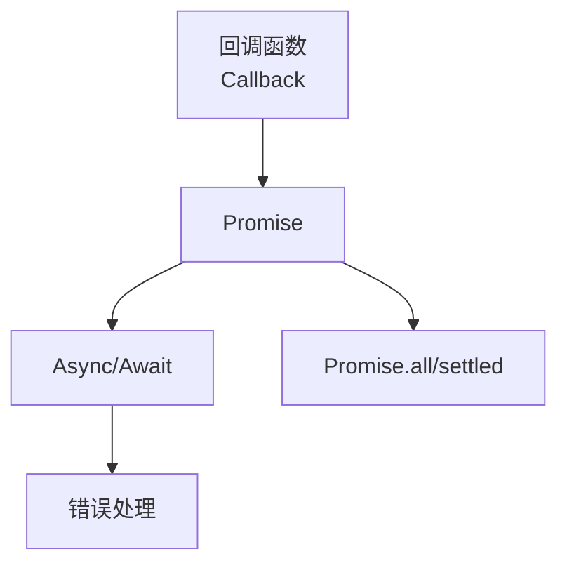

**ES6+ 新特性**
- let/const 与块级作用域
- 箭头函数
- 解构赋值
- 模板字符串
- 展开运算符
- Module 模块系统
- Map/Set 数据结构
- Iterator 与 Generator

---

## 四、TypeScript：类型安全的 JavaScript

### 4.1 TypeScript 优势

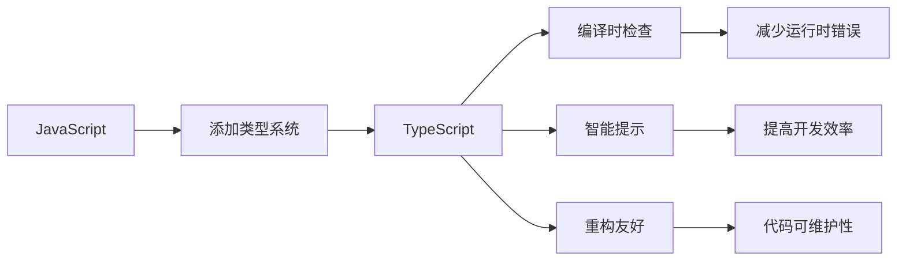

### 4.2 TypeScript 核心知识

**基础类型**
- 基本类型（string、number、boolean）
- 数组与元组
- 枚举
- any 与 unknown
- void 与 never

**高级类型**
- 接口（Interface）
- 类型别名（Type Alias）
- 联合类型与交叉类型
- 类型守卫
- 索引类型

**泛型**
```typescript
// 泛型函数
function identity<T>(arg: T): T {
  return arg;
}

// 泛型接口
interface Box<T> {
  content: T;
}

// 泛型类
class Container<T> {
  constructor(public value: T) {}
}
```

**工具类型**
- `Partial<T>` - 部分属性
- `Required<T>` - 全部必需
- `Readonly<T>` - 只读属性
- `Pick<T, K>` - 选取属性
- `Omit<T, K>` - 省略属性
- `Exclude<T, U>` - 排除类型
- `Extract<T, U>` - 提取类型

---

## 五、网页布局：从传统到现代

### 5.1 布局技术全景

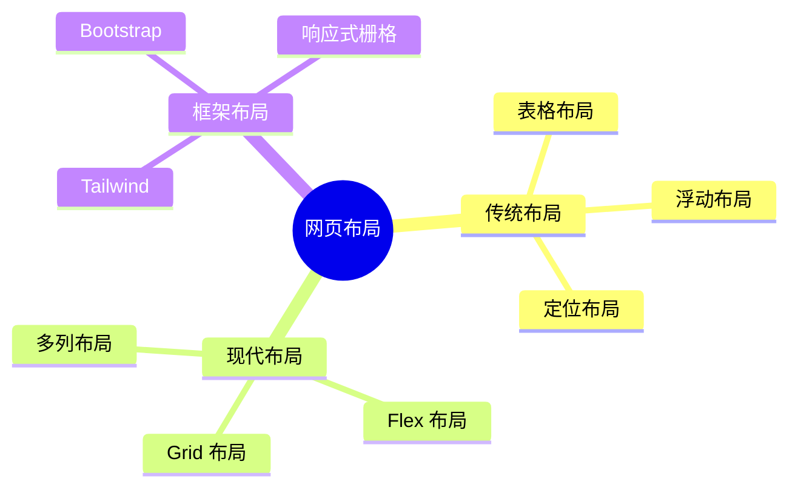

### 5.2 布局选择指南

**场景推荐：**

| 需求场景 | 推荐方案 | 理由 |
|---------|---------|------|
| 简单文档流 | 普通布局 | 自然语义 |
| 导航栏 | Flex 布局 | 对齐方便 |
| 卡片网格 | Grid 布局 | 二维控制 |
| 响应式页面 | 媒体查询 + Flex/Grid | 适配多端 |
| 复杂后台 | Bootstrap/Tailwind | 快速开发 |

---

## 六、用户交互：让页面"活"起来

### 6.1 交互知识体系

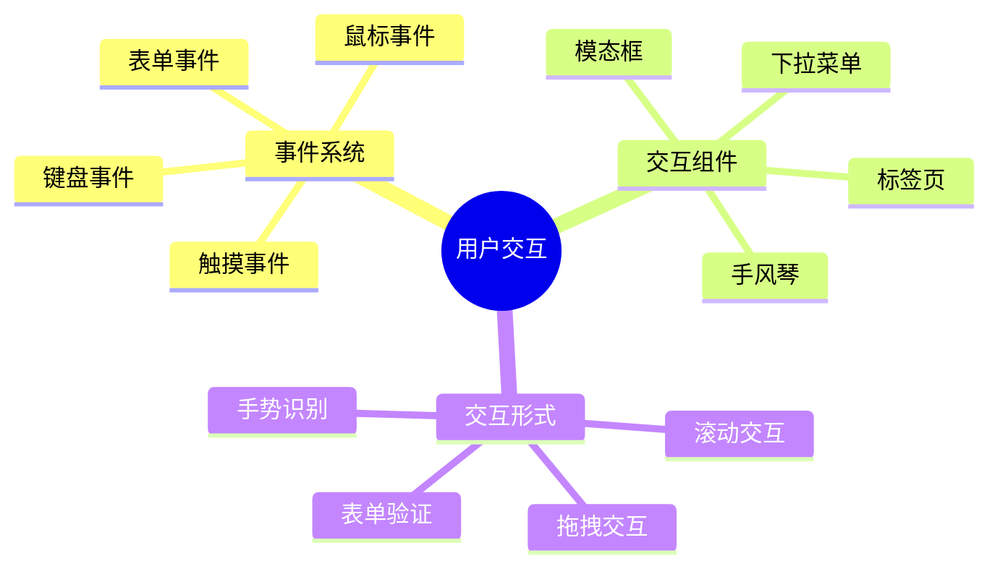

### 6.2 核心交互技术

**事件处理**
```javascript
// 事件监听
element.addEventListener('click', handler);

// 事件委托
parent.addEventListener('click', (e) => {
  if (e.target.matches('.child')) {
    // 处理子元素点击
  }
});

// 自定义事件
const event = new CustomEvent('myEvent', { detail: data });
element.dispatchEvent(event);
```

**表单交互**
- 实时验证
- 错误提示
- 提交防抖
- 文件上传进度

**模态框实现**
- 遮罩层管理
- 焦点陷阱
- ESC 关闭
- 滚动锁定

---

## 七、动画交互：提升用户体验

### 7.1 动画技术栈

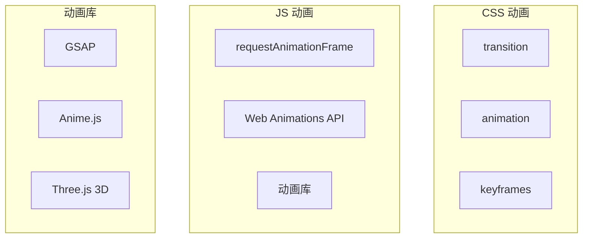

### 7.2 动画设计原则

1. **目的明确**：每个动画都应有明确的功能
2. **时长适中**：200-500ms 最舒适
3. **缓动自然**：使用 ease-in-out
4. **性能优先**：优先使用 transform 和 opacity
5. **可访问性**：支持 prefers-reduced-motion

---

## 八、后台交互：数据通信核心

### 8.1 通信技术演进

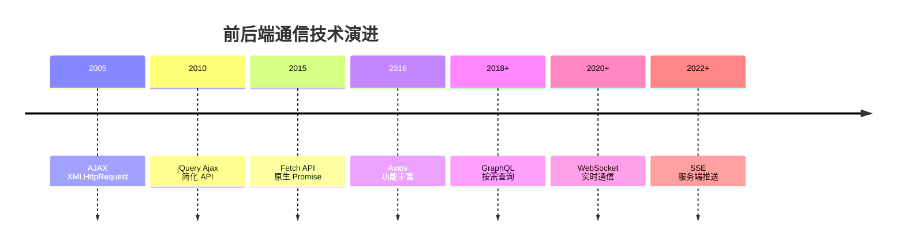

### 8.2 通信方式对比

| 技术 | 方向 | 实时性 | 复杂度 | 适用场景 |
|------|------|--------|--------|---------|
| AJAX/Fetch | 单向请求 | 低 | 低 | 常规数据获取 |
| Axios | 单向请求 | 低 | 低 | 需要拦截器 |
| GraphQL | 按需查询 | 低 | 中 | 复杂数据结构 |
| WebSocket | 双向 | 高 | 中 | 实时聊天、游戏 |
| SSE | 单向推送 | 中 | 低 | 消息通知、股票 |

### 8.3 RESTful API 设计

```
GET    /api/users      # 获取用户列表
POST   /api/users      # 创建用户
GET    /api/users/:id  # 获取单个用户
PUT    /api/users/:id  # 更新用户
DELETE /api/users/:id  # 删除用户
```

---

## 九、数据图表：可视化呈现

### 9.1 图表类型选择

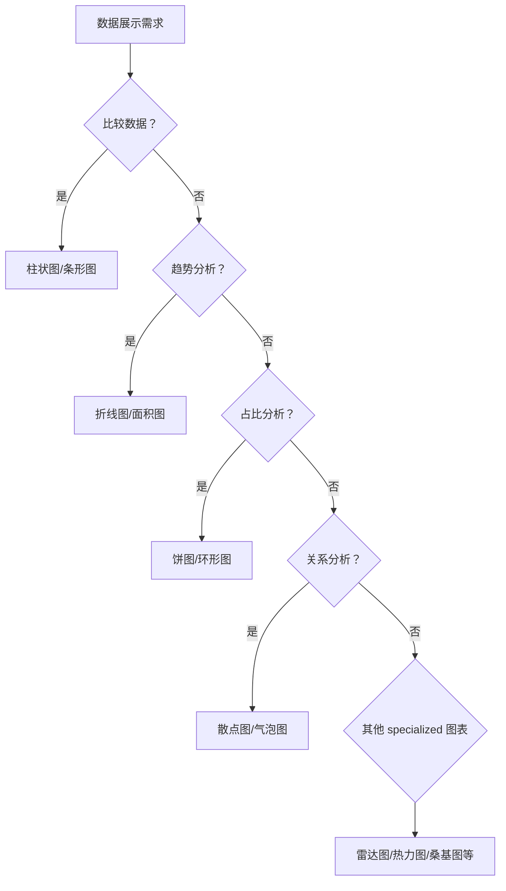

### 9.2 常用图表类型

| 图表类型 | 用途 | 典型场景 |
|---------|------|---------|
| 折线图 | 趋势展示 | 股票走势、温度变化 |
| 柱状图 | 数据对比 | 销售对比、排名 |
| 饼图 | 占比分析 | 市场份额、预算分配 |
| 散点图 | 关系分析 | 相关性研究 |
| 雷达图 | 多维对比 | 能力评估、产品对比 |
| 热力图 | 密度展示 | 用户行为、地理分布 |
| 甘特图 | 进度管理 | 项目计划、任务排期 |
| 桑基图 | 流量分析 | 用户路径、能量流动 |

### 9.3 图表库推荐

- **ECharts**：百度开源，功能全面，中文友好
- **Chart.js**：轻量级，简单易用
- **D3.js**：高度灵活，学习曲线陡
- **AntV**：蚂蚁金服，企业级方案
- **Highcharts**：商业友好，文档完善

---

## 十、框架与工具：提效利器

### 10.1 前端框架生态

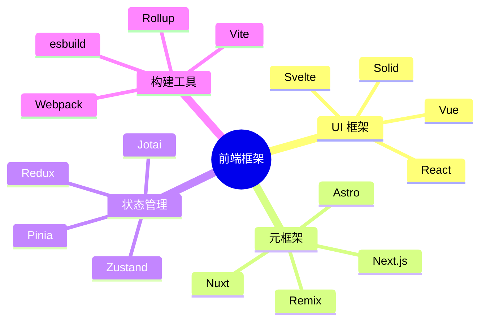

### 10.2 框架选择建议

| 项目类型 | 推荐框架 | 理由 |
|---------|---------|------|
| 企业后台 | Vue + Element/AntD | 开发效率高 |
| 复杂应用 | React + 生态 | 灵活、社区大 |
| 内容网站 | Next.js/Nuxt | SEO 友好 |
| 轻量项目 | Preact/Svelte | 体积小 |
| 跨平台 | React Native/Flutter | 一套代码多端 |

### 10.3 开发工具链

**代码编辑器**
- VS Code（主流选择）
- WebStorm（功能强大）

**版本控制**
- Git + GitHub/GitLab

**包管理器**
- npm（默认）
- yarn（稳定）
- pnpm（快速、节省空间）

**代码质量**
- ESLint（代码检查）
- Prettier（代码格式化）
- TypeScript（类型检查）

---

## 十一、调试与性能优化

### 11.1 Chrome DevTools 核心功能

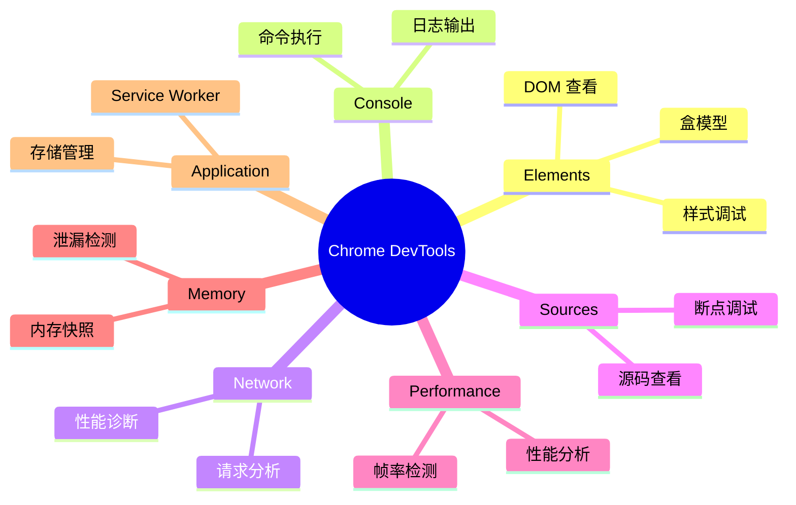

### 11.2 性能优化要点

**加载优化**
- 代码分割与懒加载
- 资源压缩与合并
- CDN 加速
- 图片优化（WebP、懒加载）

**渲染优化**
- 减少重排重绘
- 使用 CSS 硬件加速
- 虚拟列表
- 防抖节流

**缓存策略**
- HTTP 缓存（强缓存、协商缓存）
- 浏览器存储（LocalStorage、IndexedDB）
- Service Worker 离线缓存

---

## 十二、学习路线建议

### 12.1 零基础入门路径

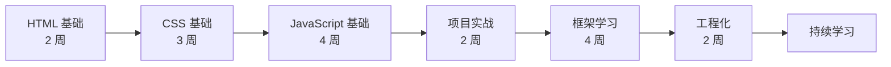

### 12.2 进阶提升方向

1. **深入原理**：框架源码、浏览器原理
2. **性能优化**：加载、渲染、缓存
3. **工程化**：构建、部署、CI/CD
4. **跨端开发**：小程序、Electron、React Native
5. **全栈能力**：Node.js、数据库、DevOps

### 12.3 2026 技术趋势

- **AI 辅助开发**：Copilot、Cursor 等工具提效
- **边缘计算**：边缘函数、Serverless
- **Web Components**：原生组件化
- **Islands 架构**：部分水合、性能优先
- **Rust 工具链**：更快的构建工具

---

## 结语：持续学习，保持热爱

前端开发是一个快速发展的领域，新技术、新框架层出不穷。掌握系统的知识体系固然重要，但更重要的是：

1. **保持好奇心**：对新事物保持开放态度
2. **动手实践**：理论结合实践，做项目是最好的学习
3. **建立知识网络**：将零散的知识点串联起来
4. **关注社区**：GitHub、Twitter、技术博客
5. **分享输出**：写作、演讲、开源贡献

希望这份前端知识体系指南能成为你学习路上的导航图。记住，**最好的学习时机是现在，最好的学习方式开始做**！

---

> 📚 **参考资料**：本文基于完整的前端知识体系网站整理，涵盖 HTML、CSS、JavaScript、TypeScript、布局、交互、动画、后台通信、数据图表等 200+ 知识点。
>
> 💡 **提示**：建议收藏本文，作为学习参考手册随时查阅。

---

*如果你觉得这篇文章对你有帮助，欢迎点赞、收藏、转发，让更多开发者受益！*
